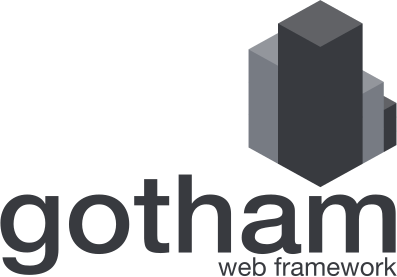

  

A flexible web framework that promotes **stability, safety, security and speed**.

 

## Features

1.  Stability focused. All releases target **stable**
    [Rust](https://www.rust-lang.org/en-US/). This will never 
    change. To ensure future compatibility, we also run automated builds against 
    Rust beta and nightly releases.
1.  Statically typed. The Gotham web framework is statically typed ensuring your
    application is **correctly expressed** at compile time.
1.  Async everything. By leveraging the [Tokio project](https://tokio.rs), all 
    Gotham web framework types are async out of the box.  Our async story is 
    further enhanced by [Hyper](https://hyper.rs), a fast server that provides 
    an elegant layer over 
    [stringly typed HTTP](http://wiki.c2.com/?StringlyTyped).
1.  Blazingly fast. Measure completed requests, including the 99th percentile, 
    in **µs**.

## License

Licensed under your option of:

* [MIT License](LICENSE-MIT)
* [Apache License, Version 2.0](LICENSE-APACHE)

## Community

The following policies guide participation in our project and our community:

* [Conduct](CONDUCT.md)
* [Contributing](CONTRIBUTING.md)

## Learning

The following resources are available to assist you learning the Gotham web
framework:

* [An extensive set of examples](examples)
* [API documentation](https://docs.rs/gotham/)
* [Gitter chatroom](https://gitter.im/gotham-rs/gotham)
* [Twitter](https://twitter.com/gotham_rs)
* [The Gotham web framework website](https://gotham.rs)

## Alternatives

We hope you'll find the Gotham web framework is flexible enough to meet the 
needs of any web application you might like to build. Please 
[have a chat with us](https://gitter.im/gotham-rs/gotham) or 
[create an issue](https://github.com/gotham-rs/gotham/issues) if you find this 
isn't the case, perhaps there is something the Gotham web framework can offer 
that will help you achieve your goals.

We do acknowledge that sometimes the choices we've made for the Gotham web
framework may not suit the needs of all projects. If that is the case for your 
project there are alternative Rust web frameworks you might like to consider:

1. [Conduit](https://github.com/conduit-rust/conduit)
1. [Iron](https://github.com/iron/iron)
1. [Nickel](https://github.com/nickel-org/nickel.rs)
1. [Pencil](https://github.com/fengsp/pencil)
1. [Rocket](https://github.com/SergioBenitez/Rocket)
1. [Rouille](https://github.com/tomaka/rouille)

Explore even more suggestions at [Are we web yet?](http://www.arewewebyet.org/).
